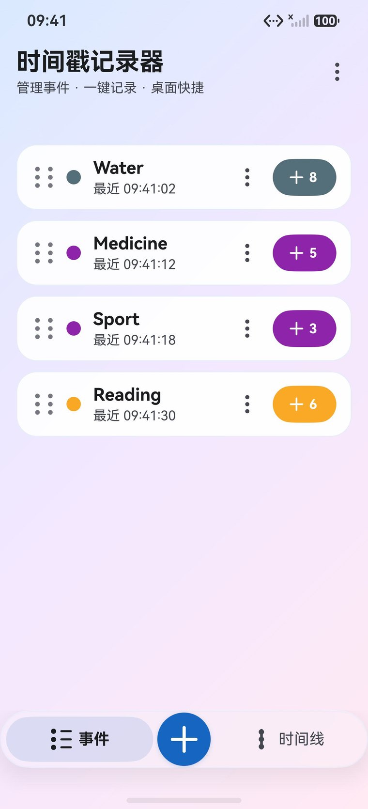
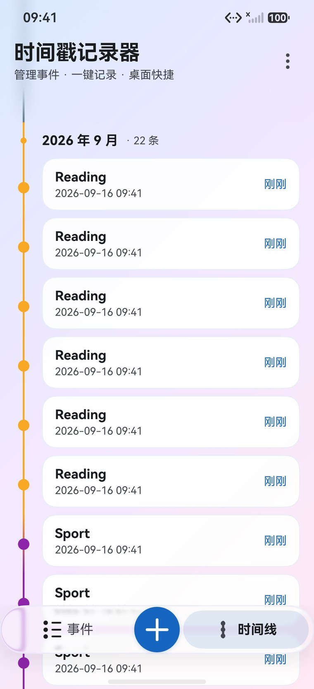
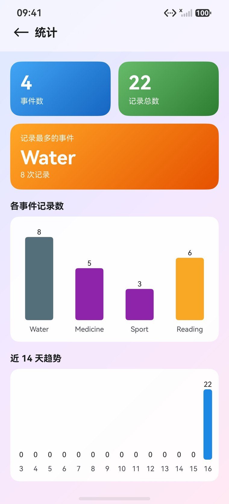
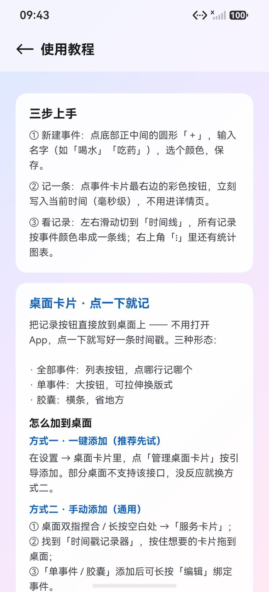

<div align="center">

# 时间戳记录器

**桌面点一下就记一笔 —— 完全离线的轻量时间戳记录工具**

HarmonyOS NEXT 原生应用 · ArkTS / ArkUI 声明式 · 与 Android 版备份互通

<br/>

<!-- 仓库实时状态：shields.io 现取 GitHub 数据，随仓库变化；每枚徽章均可点击跳转 -->
[![Release][b-release]][l-releases]
[![Stars][b-stars]][l-stars]
[![Forks][b-forks]][l-forks]
[![Issues][b-issues]][l-issues]
[![Last commit][b-commit]][l-commits]

<!-- 技术属性 -->
[![HarmonyOS NEXT][b-platform]][l-harmonyos]
[![API][b-api]][l-spec]
[![ArkTS][b-lang]][l-repo]
[![Permissions][b-perm]][l-repo]
[![HAP size][b-hap]][l-releases]

<br/>






<sub>事件列表 · 时间线 · 统计 · 使用教程 —— HarmonyOS 模拟器实拍</sub>

</div>


---

## ✨ 特性

| | 特性 | 说明 |
|---|---|---|
| 📝 | **双页浏览** | 「事件」页管理事件，「时间线」页按月倒序回看全部记录，底部胶囊岛左右切换 |
| 👆 | **可拖动滑块** | 底栏滑块 1:1 跟手，页面位移与滑块共用同一进度；松手按过半吸附切页 |
| ⏱ | **两种事件形态** | **点时刻**（记一个个瞬间）/ **时间段**（点「开始」，再点「结束」，自动算时长，进行中带秒表）—— 与 Android 版一致 |
| ⚡ | **一键记录** | 主页卡片胶囊按钮、详情页大按钮、**桌面卡片直接点** —— 三种方式都不进二级页；时间段事件点即开始 / 结束 |
| 🃏 | **桌面服务卡片** | **三套形态**（见下，共 8 个候选条目），点一下即记录，实时回刷；自定义卡片可设标题、底色或背景图 |
| 🎨 | **23 色 + 自定义取色** | 事件颜色 23 色板，末尾「#」格可直接输入十六进制色值（如 `#3B82F6`），实时预览 |
| 📊 | **统计** | 概览 + 各事件记录数柱状图 + **近 7/14/30 天趋势可切换** + **单事件聚焦** + 时间段时长汇总（Canvas 自绘，零依赖） |
| 🔀 | **排序** | 手动拖拽排序 / 按最近记录自动排序 |
| 🌗 | **深浅色** | 跟随系统；顶栏渐变模糊、底栏液态玻璃 |
| 🔒 | **零权限 · 完全离线** | 不申请任何权限，不发起任何网络请求；数据只写本机 Preferences |
| 🛡 | **隐私合规** | 首次启动 / 版本更新后弹出隐私政策，需主动勾选同意后使用；不参与系统备份、无任何外部跳转；可在「设置 → 隐私」随时查阅 |
| 💾 | **备份互通** | JSON 导出 / 导入（**format 2**，含时间段数据），**与 Android 版文件互相可用** |

---

## 🃏 桌面卡片（招牌功能）

添加到桌面后**不打开 App 就能记一笔**：

| 卡片 | 支持尺寸 | 说明 |
|---|---|---|
| **全部事件** | 2×2 · 4×4 | 列出所有事件，点某一行即给该事件记一次 |
| **单事件** | 1×2 · 2×2 · 4×4 | 绑定一个事件，整卡点击即记录，显示最近时间与累计次数 |
| **自定义** | 2×2 · 2×4 · 4×4 | 自定标题、背景色或相册背景图，并勾选要显示的事件；点行即记录 |

> ⚠️ **胶囊卡（1×2）已下线**：与「单事件」的 1×2 档功能完全重叠，候选列表已移除。
> 桌面上已添加的存量胶囊卡仍可正常显示与记录（代码保留以兼容）。

添加方式：桌面双指捏合 / 长按空白处 →「服务卡片」→ 找到本应用 → 拖到桌面；
「单事件」添加后长按可「编辑」绑定具体事件（也可在 App 内「设置 → 管理桌面卡片」一键添加）。

---

## 🚀 快速开始

### 环境要求

| 项 | 要求 |
|---|---|
| IDE | **DevEco Studio**（自带 HarmonyOS SDK） |
| SDK | 工程 `targetSdkVersion` = `26.0.0`，`compatibleSdkVersion` = `6.0.2(22)`；`compileSdkVersion` 不显式配置（用 IDE 内置 SDK） |
| 设备 | HarmonyOS **6.0.2（API 22）及以上**；「沉浸光感」液态玻璃底栏需系统支持该特性（API 26 起） |
| 签名 | 真机调试需**华为开发者账号**（DevEco 的「自动签名」即可） |

### 用 DevEco Studio 构建（推荐）

打开工程 → `File → Project Structure → Signing Configs` 勾选 **Automatically generate signature** → 点 **Run** 安装到设备或模拟器。

### 用命令行构建（hvigor 随 DevEco 一起安装）

```bash
# 0) 指向 DevEco Studio 安装目录（下例为 Windows 默认位置，按实际调整）
DEVECO="D:/Program Files/Huawei/DevEco Studio"
export DEVECO_SDK_HOME="$DEVECO/sdk"

# 1) 构建（产物：entry/build/default/outputs/default/entry-default-signed.hap）
"$DEVECO/tools/hvigor/bin/hvigorw" assembleHap --no-daemon

# 2) 安装到已连接设备（hdc 在 SDK 内）
"$DEVECO_SDK_HOME/default/openharmony/toolchains/hdc" install -r \
  entry/build/default/outputs/default/entry-default-signed.hap
```

> ℹ️ `hvigorw` 需要 Node.js 运行时；DevEco Studio 自带一份（`<DevEco>/tools/node`），加入 `PATH` 即可。
>
> ⚠️ 构建前请**关闭终端代理**：依赖源 ohpm 为国内域名，挂代理会导致 `ECONNREFUSED`。
>
> `tools/deploy_all.sh` 可一键构建并部署到所有已连接设备（脚本内含多设备遍历）。

---

## 📖 使用教程

<a id="tutorial"></a>

1. **新建事件** —— 点底部正中间的圆形「＋」，输入名字（如「喝水」「吃药」）、选个颜色，保存。
2. **记一条** —— 点事件卡片最右边的彩色按钮，立刻写入当前时间（毫秒级），不用进详情页。
3. **看记录** —— 左右滑动（或拖动底部胶囊岛）切到「时间线」，所有记录按事件颜色串成一条线；右上角「⋮」里还有统计图表。
4. **改与删** —— 时间线 / 卡片上长按即可重命名、换色或删除。
5. **备份** —— 设置 → 备份与恢复，导出 JSON（与 Android 版格式完全一致，可互相导入）。

**把记录按钮放到桌面上**（核心特色，不用打开 App 就能记）：

- 方式一 · 一键添加：设置 → 桌面卡片 →「管理桌面卡片」，按引导添加。（部分桌面不支持该接口，没反应就换方式二）
- 方式二 · 手动添加：桌面双指捏合 / 长按空白处 →「服务卡片」→ 找到「时间戳记录器」→ 按住想要的卡片拖到桌面。

> 完整图文说明在 App 内「设置 → 使用教程」里，**离线可读**。

---

## 📥 版本与下载

前往 [Releases](https://github.com/baoru0908/timestamp-recorder-harmony/releases) 查看各版本发布说明。

| 版本 | 内容 |
|---|---|
| **v1.4.8** | **AGC 审核整改：移除自建首启隐私弹窗**（审核意见「应用出现两个隐私弹窗」）—— 应用已接入华为「标准化隐私声明托管服务」，首启弹窗交由**系统在应用首次启动时自动弹出**，应用内不再自建：删除 `PrivacyGate` 首启合规门与其配套工具类 `Privacy`、移除对应路由，`EntryAbility` 首启直接加载主页；设置页「撤回隐私同意」改走系统 `privacyManager.disableService()`（撤回后清除同意记录、退出应用，下次启动重新弹出标准隐私声明）。隐私管理服务不支持模拟器，故调用已加 try-catch 并降级提示，不会崩溃。《隐私政策》阅读页与设置页入口保持不变 |
| **v1.4.7** | **UX 规范整改：滑动过界反馈 + 点击热区**（依据《通用应用 UX 体验标准》）：① **滑动到边界有回弹反馈**（2.1.5.3.3）—— 给全部 **10 个原来没设的滚动容器**补上弹性回弹（7 处 `Scroll` 默认无任何反馈、3 处 `List` 短内容时无回弹），并统一开启"内容不足一屏也可回弹"；② **点击热区达标**（2.1.3.3，**必须级**）—— 色板「#」按钮与事件行 ⋮「更多」按钮由 34×34 提升到 **40×40 vp**；顺带统一了色板内控件尺寸。冒烟验证：其余 UX 条目中字号（≥8vp）✅ 通过 |
| **v1.4.6** | **隐私声明跟随托管页更新**：应用内声明与华为「标准化隐私声明托管服务」（AGC 提审所填链接）保持**逐字一致**——更新日期 `2026.9.22`；1.1 条改为「我们为您提供了**基本功能服务和全量功能服务**…在基本功能服务下不收集个人信息，仅提供事件时间戳（段）记录基本功能，不提供云同步、云端分析等其他附加功能」；3.2 条改为「传输并保存至您**的设备**的服务器」。生效日期仍为 `2026.9.21` |
| **v1.4.5** | **app 内隐私声明与华为托管页逐字一致**：正文按托管页**可见内容**逐字重写为 4 节（1 收集使用 / 2 管理您的个人信息 / 3 信息存储地点及期限 / 4 如何联系我们），日期格式对齐为 `2026.9.21`；前言段不带标题（与托管页一致）；三处副本同步（应用内 `PrivacyDoc.ets` / 根 `privacy.html` / `release/privacy.html`）。同时固化了**发布签名流程**（此前 v1.4.4 的包误用调试证书签名，AGC 会报 993） |
| **v1.4.4** | **卡片候选精简 + 跨卡同步修复 + 隐私合规补齐**：候选列表移除与「单事件 1×2」完全重复的胶囊卡（9 → 8 个条目），顺序重排为「全部事件 → 单事件 → 自定义」（存量胶囊卡仍可正常使用）；修复「在一张卡片上记录后，其他桌面卡片不刷新」（v1.4.2 缩短刷新链路时的回归），点击后先一步刷新被点卡、再补刷其余卡，并对连点做合并防重复刷新；按《华为应用市场审核指南》第 7 章补齐隐私政策：新增**「已收集个人信息清单」「第三方共享个人信息清单」**，新增**设置 → 隐私 → 撤回隐私同意**入口，补充投诉 **15 个工作日**处理时效与「本应用无账号体系、不涉及注销」声明 |
| **v1.4.3** | **多事件卡片排版规范化**：建立统一排版档位（1×2 / 2×2 / 2×4 / 4×4 各自一整套字号与间距），修正标题与行内文本**左基线不齐**的历史问题；行数上限改为与档位同源（不再固定 4/6 行），溢出显示「还有 N 个事件」；四类卡片共用同一套层级与间距规则 |
| **v1.4.2** | **修复卡片交互后刷新失效**：点卡片后桌面卡片停留在旧数据（表现为「内容回退」，如绑了 A 事件点一下变回 B 事件）—— 根因是 `onFormEvent` 靠异步反查卡片类型、链路过长，进程被回收时刷新丢失；改为添加卡片时落盘 `formId → 卡片类型` 映射，点击后一步刷新。同时绑定列表对时间段事件显示「N 段」 |
| **v1.4.1** | **卡片时间段事件对齐安卓**：桌面卡片点时间段事件 = 开始/结束切换（修复前会错误地多记一条）；卡片行显示「● 进行中 / 未开始 / 未记录 / 最近一段结束时间」；单事件卡片计数改「共 N 次」（时间段=段数）、提示「点击开始 / 结束」；胶囊卡片支持「▶ 开始 / ■ 结束」；**备份 intervals 顺序对齐安卓**（修复跨平台互导后取错段）；`startInterval` 改为"先结束旧的再开新的" |
| **v1.4.0** | **自定义卡片**（标题 + 背景色 / 相册背景图 + 勾选多事件，对齐 Android 第三套卡片）；**事件色板 12 → 23 色** + 十六进制自定义色（抽成共享取色组件）；胶囊/单事件卡片配置页不变 |
| **v1.3.1** | 修复主页时间段卡片点「结束」后按钮不刷新；合规强化：教程页移除网页跳转（全应用零外部链接）、《用户协议》暂时撤下（待正式文本）、《用户协议》移除后隐私政策补充「不参与系统备份」说明、关闭系统级数据备份参与、剩余日志全部 debug 门控 |
| **v1.3.0** | **时间段（区间）事件**：点时刻 / 时间段两种形态，开始-结束计时、进行中秒表、时长统计，备份格式升级到 v2（与 Android 版互通）；**开屏隐私合规门**：首次启动与版本更新后需勾选同意隐私政策与用户协议；**移除关于页**，协议入口迁入设置页；统计页支持 7/14/30 天趋势切换与单事件聚焦；CSV 导出加 UTF-8 BOM |
| **v1.2.0** | 首个上架版本：应用市场合规整改 + 发布签名闭环 |
| **v1.1.1** | 修正关于页文案（原先声称内嵌 MiSans，实际使用系统字体）与主页空态引导方位；移除未使用的网络权限，**现在真正零权限** |
| **v1.1.0** | 液态玻璃底栏（沉浸光感）+ 可拖动滑块联动切页；顶栏渐变模糊（对齐系统设置页）；时间轴跟随页面滑动；工具链升级 HarmonyOS 26 / API 26 |
| **v1.0.0** | 首个公开版本：事件管理 / 时间线彩虹轴 / 三套桌面卡片 / 统计图表 / 备份互通 |

> **版本号规则（语义化）**：`versionName = major.minor.patch`；
> `versionCode = major×1,000,000 + minor×1,000 + patch`（如 1.1.0 → 1001000）。
>
> 本仓库为**源码发布**：签名与开发者账号绑定，不便随 Release 分发 HAP，请按「快速开始」自行构建安装。

---

## 🔗 与 Android 版的关系

本工程是 Android 版 [TimestampRecorder](https://github.com/baoru0908/timestamp-recorder) 的**纯血鸿蒙原生实现（移植而非复刻）** —— 功能特性对齐、数据格式互通，UI 遵循 HarmonyOS Design 与服务卡片规范。

| 项 | 约定 |
|---|---|
| 包名 | `com.timestamp.recorder`（两端一致） |
| 备份 JSON | **格式完全一致**：`app: "timestamp-recorder"`、`format: 1`，两边导出的文件可互相导入 |
| 存储键名 | Preferences `tsr_data` → `events`（顺序即手动排序）/ `records_<eventId>`（最新在前） |
| 颜色存储 | 有符号 int（读取时做无符号转换，两端一致） |

> ⚠️ 两端**应用数据不互通**（沙箱隔离），跨设备迁移请使用**备份 JSON 导入导出**。

---

## 🛠 技术栈

- **ArkTS / ArkUI 声明式** · Stage 模型，单 HAP 体积 < 1 MB
- **`@kit.ArkData` Preferences** —— 本地键值存储（无数据库、无网络）
- **FormKit 服务卡片** —— `postCardAction` 实现卡片内点击即记录
- **`CanvasRenderingContext2D`** —— 统计图表自绘
- **`uiMaterial.systemMaterial`** —— 底栏「沉浸光感」液态玻璃（HarmonyOS 6/7 高级材质，API 26）
- **`linearGradientBlur` + `backgroundEffect`** —— 顶栏渐变模糊（内容进标题区渐进糊化、向下收束，无硬切）
- **`Swiper.startFakeDrag / fakeDragBy`** —— 底栏滑块与页面位移共用同一进度，1:1 跟手
- 图标全部自绘矢量、零第三方依赖

---

## 📁 工程结构

```
entry/src/main/ets/
├─ data/                EventRepository —— Preferences 数据层（事件 / 记录 CRUD、备份导入导出）
├─ model/               TimestampEvent（事件 / 记录模型）、CardData（卡片载荷）
├─ util/                Theme（深浅色令牌 + 玻璃材质）、TimeFormat（时间格式化）、FormSync（卡片回刷）
├─ pages/               Index（主页双页 + 底栏胶囊岛）、EventDetail、Stats、Settings、Tutorial、About、FormConfig
├─ widget/pages/        AllEventsCard、SingleEventCard、CustomCard（三套候选）；CapsuleCard 仅存量兼容
├─ formability/         FormAbility —— 卡片生命周期与 message 事件
├─ entryability/        EntryAbility、FormConfigAbility
└─ entrybackupability/  EntryBackupAbility —— 系统备份扩展

docs/screenshots/       README 用图
tools/                  deploy_all.sh（一键多设备构建部署）
```

---

---

<div align="center">
<sub>© 2026 baoru0908 · 独立开发者个人项目 · 灵感来自日常记录需求</sub><br/>
<sub>Android 版：<a href="https://github.com/baoru0908/timestamp-recorder">baoru0908/timestamp-recorder</a></sub>
</div>


---

<!-- ================= 徽章与跳转目标（引用式定义，不参与正文渲染） ================= -->

[b-release]: https://img.shields.io/github/v/release/baoru0908/timestamp-recorder-harmony?style=flat-square&label=release&color=2ea44f&sort=semver
[b-stars]: https://img.shields.io/github/stars/baoru0908/timestamp-recorder-harmony?style=flat-square&label=stars&color=0969da&logo=github&logoColor=white
[b-forks]: https://img.shields.io/github/forks/baoru0908/timestamp-recorder-harmony?style=flat-square&label=forks&color=6b7280&logo=github&logoColor=white
[b-issues]: https://img.shields.io/github/issues/baoru0908/timestamp-recorder-harmony?style=flat-square&label=issues&color=d97706&logo=github&logoColor=white
[b-commit]: https://img.shields.io/github/last-commit/baoru0908/timestamp-recorder-harmony?style=flat-square&label=last%20commit&color=16a34a&logo=git&logoColor=white
[b-platform]: https://img.shields.io/badge/Platform-HarmonyOS_NEXT-0052D9?style=flat-square&logo=harmonyos&logoColor=white
[b-api]: https://img.shields.io/badge/API-22%2B-007ACC?style=flat-square
[b-lang]: https://img.shields.io/badge/Language-ArkTS-8114E5?style=flat-square
[b-perm]: https://img.shields.io/badge/Permissions-None-2ea44f?style=flat-square
[b-hap]: https://img.shields.io/badge/HAP-%3C1_MB-6b7280?style=flat-square

[l-repo]: https://github.com/baoru0908/timestamp-recorder-harmony
[l-releases]: https://github.com/baoru0908/timestamp-recorder-harmony/releases
[l-stars]: https://github.com/baoru0908/timestamp-recorder-harmony/stargazers
[l-forks]: https://github.com/baoru0908/timestamp-recorder-harmony/forks
[l-issues]: https://github.com/baoru0908/timestamp-recorder-harmony/issues
[l-commits]: https://github.com/baoru0908/timestamp-recorder-harmony/commits/main
[l-spec]: https://github.com/baoru0908/timestamp-recorder-harmony
[l-harmonyos]: https://developer.huawei.com/consumer/cn/
